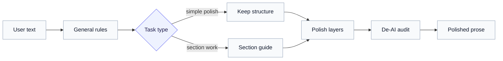

# Asset Pricing Writing Skill

[](LICENSE)
[](SKILL.md)

A Codex skill for polishing empirical asset-pricing prose in a restrained top finance journal style.

The skill is distilled from 101 asset-pricing papers published in the **Journal of Finance (JF)**, **Journal of Financial Economics (JFE)**, and **The Review of Financial Studies (RFS)**. It is designed for rewriting, polishing, and drafting academic finance prose while preserving the author's facts, notation, citations, tables, equations, numbers, and claim strength.

## What It Does

This skill helps polish empirical finance prose into a top finance journal style, especially for asset-pricing papers.

## Workflow of the Skill



## Reference System

| Reference | Purpose |
| --- | --- |
| `references/general-rules.md` | Core writing rules used for every request, based on John H. Cochrane's [Writing Tips for Ph.D. Students](https://static1.squarespace.com/static/5e6033a4ea02d801f37e15bb/t/5eea8ee7c4488718b640f3c6/1592430312374/phd_paper_writing.pdf). |
| `references/sections/` | Section-specific guides for abstracts, introductions, data, models, empirical findings, and conclusions. |
| `references/sentence-functions.md` | Sentence-level structure for weak, vague, translated, overlong, or poorly ordered prose. |
| `references/lexical-choices.md` | Corpus-grounded verbs, phrases, and collocations for empirical asset-pricing writing. |
| `references/de-ai-rules.md` | Final de-AI review. |

## Installation

Copy the skill folder into your Codex skills directory:

```powershell
Copy-Item -Path "asset-pricing-writing-polisher" `
  -Destination "$env:USERPROFILE\.codex\skills\asset-pricing-writing-polisher" `
  -Recurse
```

Restart Codex after installation.

## Sample Prompts

```text
Polish this sentence using the asset-pricing-writing-polisher skill.
```

```text
Rewrite this abstract using the asset-pricing-writing-polisher skill.
```

## License

This project is released under the MIT License. See [LICENSE](LICENSE) for details.
